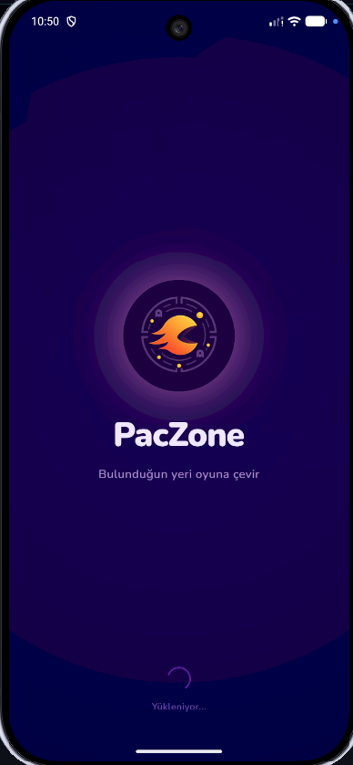
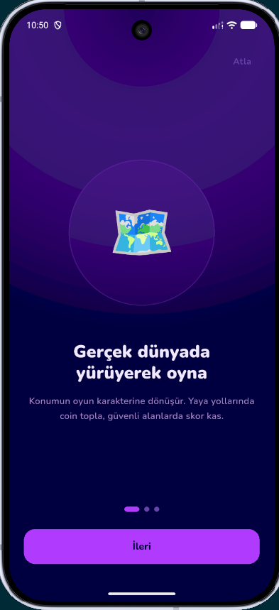
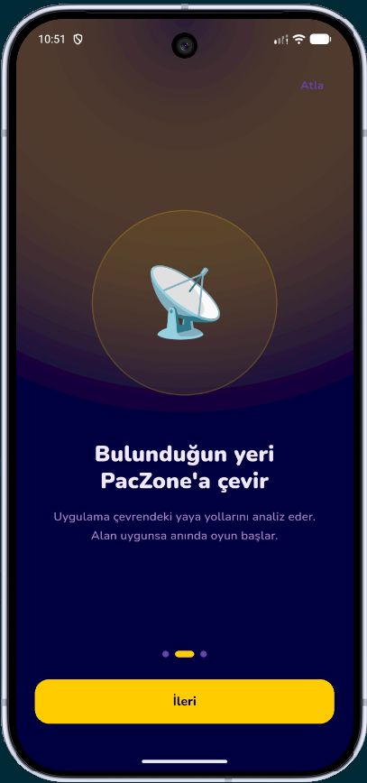
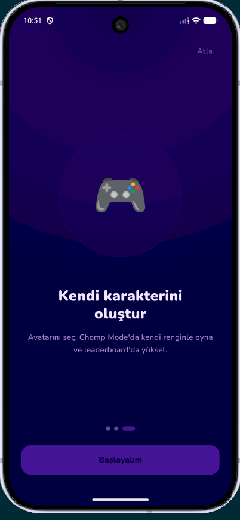
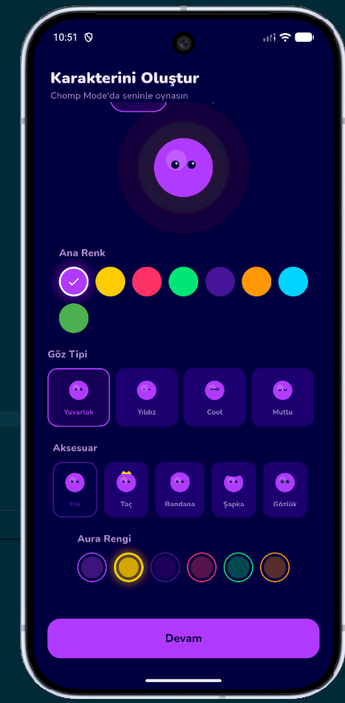
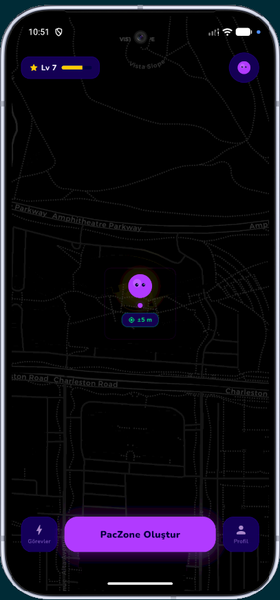
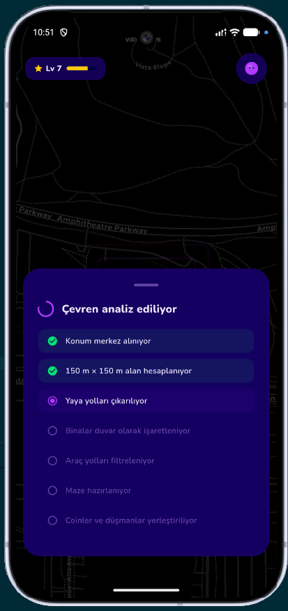
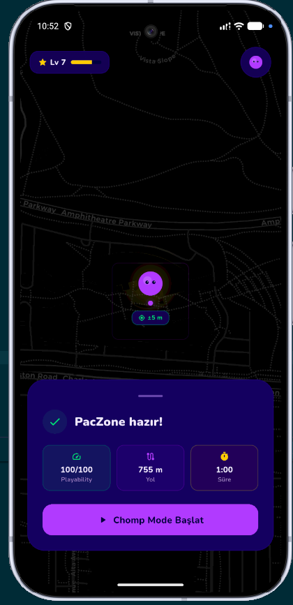
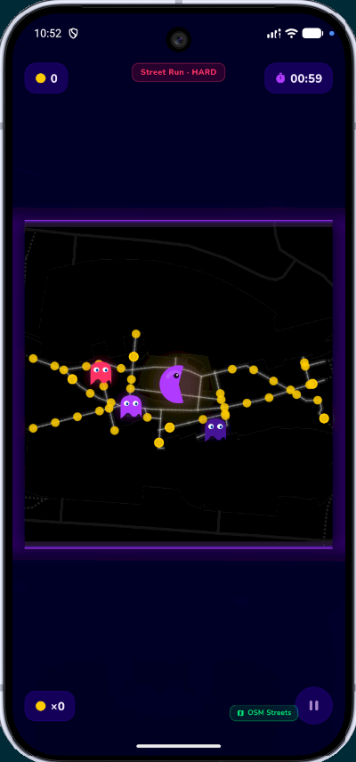
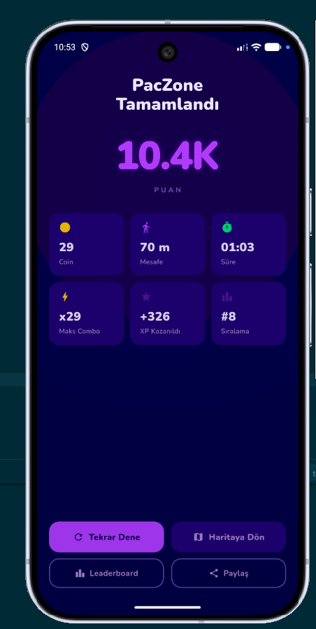

# PacZone

<p align="center">
  
</p>

<p align="center">
  <b>TR:</b> Bulunduğun yeri oyuna çevir.<br/>
  <b>EN:</b> Turn your current location into a playable game zone.
</p>

<p align="center">
  
  
  
  
</p>

---

## Dil / Language

- [Türkçe README](#türkçe)
- [English README](#english)

---

# Türkçe

## İçindekiler

- [Proje Özeti](#proje-özeti)
- [Ana Fikir](#ana-fikir)
- [Ekran Görselleri](#ekran-görselleri)
- [Kullanıcı Akışı](#kullanıcı-akışı)
- [Dynamic PacZone Mantığı](#dynamic-paczone-mantığı)
- [Gerçek Dünya → Oyun Objeleri](#gerçek-dünya--oyun-objeleri)
- [Playability Score](#playability-score)
- [UI / UX Yaklaşımı](#ui--ux-yaklaşımı)
- [Özellikler](#özellikler)
- [Teknik Mimari](#teknik-mimari)
- [Önerilen Teknoloji Stack'i](#önerilen-teknoloji-stacki)
- [API Taslağı](#api-taslağı)
- [Proje Klasör Yapısı](#proje-klasör-yapısı)
- [Kurulum Taslağı](#kurulum-taslağı)
- [Yol Haritası](#yol-haritası)
- [Telif ve Marka Notu](#telif-ve-marka-notu)

---

## Proje Özeti

**PacZone**, kullanıcının anlık konumunu merkez alarak gerçek dünyadaki yürünebilir yolları arcade tarzı bir oyun alanına dönüştüren konum tabanlı mobil oyun konseptidir.

Kullanıcı uygulamada **PacZone Oluştur** butonuna bastığında sistem, kullanıcının bulunduğu noktanın etrafında yaklaşık **150 m × 150 m** bir kare alan oluşturur. Bu kare alanın içinde kalan gerçek dünya objeleri analiz edilir:

- Yaya yolları oynanabilir maze koridorlarına dönüşür.
- Binalar ve geçilemeyen alanlar duvar olur.
- Araç yolları riskli veya engellenmiş alan olarak değerlendirilir.
- Coinler ve düşmanlar yalnızca yürünebilir path üzerinde oluşturulur.
- Kullanıcının avatarı **Chomp Mode** formuna dönüşür.

Bu proje klasik “haritada belirli bir yere git ve oyna” modeli değildir. PacZone’un ana farkı, kullanıcının bulunduğu alanı anlık olarak tarayıp güvenliyse oyuna dönüştürmesidir.

---

## Ana Fikir

PacZone’un temel cümlesi:

> Kullanıcı nerede ise orası denenir. Alan güvenliyse PacZone oluşur, güvenli değilse oyun başlatılmaz.

Bu yüzden PacZone’da ana oyun modu önceden belirlenmiş zone’lar değildir. Kullanıcının mevcut konumu merkez alınır ve çevresindeki gerçek dünya geometrileri oyun haritasına dönüştürülür.

```txt
Kullanıcının anlık GPS konumu
↓
150 m × 150 m kare analiz alanı
↓
Alan içindeki gerçek dünya objeleri
↓
Yürünebilir yollar = oynanabilir maze içi
Binalar = maze duvarı
Araç yolları = blocked / riskli alan
↓
Coin + enemy + player start üretimi
↓
Chomp Mode
```

---

## Ekran Görselleri

### Splash ve Onboarding

| Splash | Yürüyerek Oyna | Alanı PacZone'a Çevir |
|---|---|---|
|  |  |  |

| Kendi Karakterini Oluştur | Avatar Oluşturma |
|---|---|
|  |  |

### Ana Akış

| Home Map | Alan Analizi | PacZone Hazır |
|---|---|---|
|  |  |  |

### Oyun ve Sonuç

| Gameplay | Result |
|---|---|
|  |  |

---

## Kullanıcı Akışı

1. Kullanıcı uygulamayı açar.
2. Splash ekranı gösterilir.
3. Kısa onboarding akışı tamamlanır.
4. Kullanıcı kendi avatarını oluşturur.
5. Ana harita ekranında avatarını görür.
6. Kullanıcı **PacZone Oluştur** butonuna basar.
7. Sistem kullanıcının mevcut konumunu merkez alır.
8. Yaklaşık **150 m × 150 m** kare alan oluşturulur.
9. Bu alan içinde kalan yollar, binalar ve riskli bölgeler analiz edilir.
10. Alan güvenliyse **PacZone hazır** sonucu gösterilir.
11. Kullanıcı **Chomp Mode Başlat** butonuna basar.
12. Avatar Chomp Mode formuna dönüşür.
13. Kullanıcı gerçek dünyada yürüyerek coin toplar ve düşmanlardan kaçar.
14. Oyun bitince skor, coin, mesafe, süre, XP ve sıralama gösterilir.

---

## Dynamic PacZone Mantığı

PacZone’un en önemli sistemi **Dynamic PacZone Generation** mekanizmasıdır.

Bu mekanizma şu şekilde çalışır:

```txt
1. Kullanıcı PacZone Oluştur'a basar
2. GPS konumu alınır
3. Konum doğruluğu ve hız kontrol edilir
4. Kullanıcının konumu merkez alınır
5. 150 m × 150 m kare boundary oluşturulur
6. Boundary içindeki harita verileri çekilir
7. Yaya yolları, binalar ve araç yolları sınıflandırılır
8. Yürünebilir path ağı çıkarılır
9. Playability Score hesaplanır
10. Alan uygunsa coin ve enemy noktaları üretilir
11. Oyun başlatılır
```

Önemli nokta:

> Maze rastgele çizilmez. Maze, gerçek dünyadaki yürünebilir yol ağından üretilir.

---

## Gerçek Dünya → Oyun Objeleri

| Gerçek dünya verisi | PacZone karşılığı |
|---|---|
| `building` polygonları | Duvar / geçilemez alan |
| Kapalı veya erişilemeyen alanlar | Blocked area |
| Araç yolları | Riskli / blocked alan |
| `footway` | Oynanabilir maze koridoru |
| `path` | Oynanabilir maze koridoru |
| `pedestrian` alanlar | Oynanabilir alan |
| Park içi yürüyüş yolları | Oynanabilir koridor |
| Kampüs içi yaya yolları | Oynanabilir koridor |
| Kullanıcı GPS konumu | Player start point |
| Güvenli path segmentleri | Coin ve enemy spawn alanları |

---

## Playability Score

Her analiz edilen alan 0-100 arası bir **Playability Score** alır.

Score kriterleri:

- Toplam yaya yolu uzunluğu
- Yaya yolu bağlantılılığı
- Kullanıcının güvenli path’e yakınlığı
- Araç yolu yoğunluğu
- Araç yolu / yaya yolu oranı
- Bina ve blocked area yoğunluğu
- GPS doğruluğu
- Kullanıcı hızı
- Path çeşitliliği

| Score | Durum | Karar |
|---|---|---|
| 80-100 | Çok iyi | PacZone güçlü şekilde başlatılır |
| 60-79 | Uygun | Standart PacZone başlatılır |
| 45-59 | Sınırlı | Kısa PacZone önerilebilir |
| 0-44 | Uygun değil | Oyun başlatılmaz |

Başarısız alan mesajı:

> Bu alan PacZone için güvenli değil. Yaya yolu yoğunluğu düşük veya araç yolları fazla olabilir. Park, kampüs, sahil yolu veya meydan gibi bir alanda tekrar deneyin.

---

## UI / UX Yaklaşımı

PacZone’un arayüzü üç prensibe göre tasarlanır:

1. Sade
2. Anlaşılır
3. Harita merkezli

Ana ekranın temel bileşenleri:

- Fullscreen harita
- Kullanıcı avatarı
- Kullanıcı merkezli scan alanı
- **PacZone Oluştur** butonu
- Minimal seviye / XP göstergesi
- Profil kısa yolu
- Görevler kısa yolu

Klasik 5 ikonlu bottom navigation yerine floating action dock kullanılır.

```txt
[Görevler]      [PacZone Oluştur]      [Profil]
```

---

## Özellikler

### Mevcut / Tasarlanan

- Splash screen
- 3 adımlı onboarding
- Avatar oluşturma
- Ana harita ekranı
- Kullanıcı merkezli PacZone scan alanı
- Alan analiz loading durumu
- Success / failed scan state’leri
- Chomp Mode geçişi
- Mock gameplay ekranı
- Coin toplama UI’ı
- Enemy / ghost UI’ı
- Result ekranı
- XP, coin, mesafe, süre, sıralama gösterimi

### Planlanan

- Gerçek konum entegrasyonu
- MapLibre / OSM tabanlı harita
- FastAPI backend
- OSMnx ile gerçek yaya yolu analizi
- PostGIS cache sistemi
- Path snapping
- Gerçek coin ve enemy path algoritması
- Leaderboard
- EventZone bonus modları

---

## Teknik Mimari

```txt
Flutter Mobile App
│
├── Presentation Layer
│   ├── Splash
│   ├── Onboarding
│   ├── Avatar Creation
│   ├── Home Map
│   ├── Scan Bottom Sheet
│   ├── Game Screen
│   └── Result Screen
│
├── State Layer
│   ├── Avatar State
│   ├── Location State
│   ├── Scan State
│   └── Game State
│
├── Service Layer
│   ├── Location Service
│   ├── Scan Service
│   ├── Game Service
│   └── Profile Service
│
├── Map Layer
│   ├── MapLibre / OSM tiles
│   └── Game overlays
│
└── API Layer
    └── FastAPI Backend

Backend
│
├── Dynamic Zone Analyzer
├── Playability Scorer
├── OSMnx Processor
├── PostGIS Repository
├── Coin Generator
├── Enemy Route Generator
└── Score Validator
```

---

## Önerilen Teknoloji Stack'i

### Mobil

| Alan | Teknoloji |
|---|---|
| Framework | Flutter |
| Dil | Dart |
| State Management | Riverpod veya Provider |
| Routing | go_router |
| Harita | MapLibre / OSM tabanlı tile |
| Konum | Geolocator |
| Oyun Layer | CustomPaint veya Flame |
| UI Assets | SVG / PNG |

### Backend

| Alan | Teknoloji |
|---|---|
| API | FastAPI |
| Dil | Python |
| Validation | Pydantic |
| Harita Analizi | OSMnx |
| Geometri | Shapely / GeoPandas |
| Veritabanı | PostgreSQL + PostGIS |
| Cache | Redis, opsiyonel |
| Deploy | Render / Railway / VPS / Cloud |

---

## API Taslağı

### `POST /api/v1/dynamic-zones/analyze`

Mobil uygulama kullanıcının konumunu backend’e gönderir.

#### Request

```json
{
  "latitude": 41.012345,
  "longitude": 29.012345,
  "accuracy": 8.5,
  "heading": 120.0,
  "speed": 1.2,
  "timestamp": "2026-05-01T12:30:00Z",
  "scanSizeMeters": 150
}
```

#### Success Response

```json
{
  "playable": true,
  "status": "success",
  "playabilityScore": 84,
  "reason": null,
  "suggestion": null,
  "zone": {
    "zoneId": "temp_zone_9f21",
    "name": "Dynamic PacZone",
    "modeType": "classic_run",
    "difficulty": "normal",
    "estimatedDurationSeconds": 150,
    "estimatedDistanceMeters": 420,
    "boundary": [],
    "playerStartPoint": {
      "latitude": 41.012345,
      "longitude": 29.012345
    },
    "playablePaths": [],
    "buildings": [],
    "blockedRoads": [],
    "coins": [],
    "enemies": []
  }
}
```

#### Failed Response

```json
{
  "playable": false,
  "status": "failed",
  "playabilityScore": 32,
  "reason": "Yaya yolu yoğunluğu düşük veya araç yolları fazla.",
  "suggestion": "Park, kampüs, sahil yolu veya meydan gibi yaya alanlarında tekrar deneyin.",
  "zone": null
}
```

---

## Proje Klasör Yapısı

### Flutter

```txt
lib/
├── main.dart
├── app.dart
├── core/
│   ├── constants/
│   ├── theme/
│   ├── utils/
│   └── widgets/
├── models/
├── mock/
├── services/
├── routing/
├── state/
└── features/
    ├── splash/
    ├── onboarding/
    ├── avatar_creation/
    ├── location_permission/
    ├── home_map/
    ├── game/
    ├── result/
    ├── leaderboard/
    ├── profile/
    ├── avatar_edit/
    └── daily_route/
```

### Backend

```txt
paczone-backend/
├── main.py
├── requirements.txt
├── .env
├── app/
│   ├── core/
│   ├── api/
│   ├── schemas/
│   ├── services/
│   ├── repositories/
│   └── utils/
└── tests/
```

---

## Kurulum Taslağı

> Bu bölüm proje yapısı hazırlandığında gerçek komutlarla güncellenebilir.

### Flutter

```bash
flutter pub get
flutter run
```

### Backend

```bash
python -m venv venv
source venv/bin/activate
pip install -r requirements.txt
uvicorn main:app --reload
```

Windows için:

```powershell
python -m venv venv
venv\Scripts\activate
pip install -r requirements.txt
uvicorn main:app --reload
```

---

## Yol Haritası

### Faz 1: UI Prototype

- Splash
- Onboarding
- Avatar creation
- Home map mock
- Scan bottom sheet
- Mock gameplay
- Result screen

### Faz 2: Real Location + Map

- Geolocator
- MapLibre
- Real location marker
- Scan boundary
- GPS weak / speed high states

### Faz 3: Backend API

- FastAPI
- Dynamic zone analyze endpoint
- Mock response
- Flutter API connection

### Faz 4: Real OSM Analysis

- OSMnx
- Yaya yolu analizi
- Bina polygonları
- Araç yolu filtreleme
- Playability Score

### Faz 5: Gameplay Core

- Path snapping
- Coin placement
- Enemy routes
- Score validation
- Leaderboard

### Faz 6: Field Testing

- Park testi
- Kampüs testi
- Sahil yürüyüş yolu testi
- Şehir içi düşük uygunluk testi
- Güvenlik mesajlarının doğrulanması

---

# English

## Table of Contents

- [Project Overview](#project-overview)
- [Core Idea](#core-idea)
- [Screenshots](#screenshots)
- [User Flow](#user-flow)
- [Dynamic PacZone Logic](#dynamic-paczone-logic)
- [Real World → Game Objects](#real-world--game-objects)
- [Playability Score](#playability-score-1)
- [UI / UX Approach](#ui--ux-approach)
- [Features](#features)
- [Technical Architecture](#technical-architecture)
- [Recommended Tech Stack](#recommended-tech-stack)
- [API Draft](#api-draft)
- [Project Structure](#project-structure)
- [Setup Draft](#setup-draft)
- [Roadmap](#roadmap)
- [Copyright and Brand Note](#copyright-and-brand-note)

---

## Project Overview

**PacZone** is a location-based mobile game concept that turns real-world walkable paths around the user into an arcade-style playable game area.

When the user taps **Create PacZone**, the system creates an approximately **150 m × 150 m** square area centered on the user’s current location. The real-world map objects inside this square are analyzed and transformed into game objects:

- Pedestrian paths become playable maze corridors.
- Buildings and inaccessible areas become walls.
- Vehicle roads are treated as risky or blocked areas.
- Coins and enemies are placed only on walkable paths.
- The user’s avatar transforms into **Chomp Mode**.

PacZone is not mainly about walking to predefined zones. Its core innovation is attempting to turn the user’s current location into a playable zone in real time, only if the area is safe enough.

---

## Core Idea

The core rule:

> Wherever the user is, that place is tested. If it is safe, a PacZone is generated. If not, the game does not start.

PacZone uses the user’s current GPS position as the center point and transforms the surrounding real-world geometry into a game map.

```txt
User's current GPS location
↓
150 m × 150 m square analysis area
↓
Real-world map objects inside the area
↓
Walkable paths = playable maze corridors
Buildings = maze walls
Vehicle roads = blocked / risky areas
↓
Coin + enemy + player start generation
↓
Chomp Mode
```

---

## Screenshots

### Splash and Onboarding

| Splash | Walk to Play | Turn Place into PacZone |
|---|---|---|
|  |  |  |

| Create Your Character | Avatar Creation |
|---|---|
|  |  |

### Main Flow

| Home Map | Area Scan | PacZone Ready |
|---|---|---|
|  |  |  |

### Gameplay and Result

| Gameplay | Result |
|---|---|
|  |  |

---

## User Flow

1. The user opens the app.
2. The splash screen is shown.
3. The user completes a short onboarding flow.
4. The user creates a custom avatar.
5. The user sees their avatar on the main map screen.
6. The user taps **Create PacZone**.
7. The system uses the user’s current location as the center point.
8. An approximately **150 m × 150 m** square analysis area is generated.
9. Roads, buildings, walkable paths, and risky areas inside the square are analyzed.
10. If the area is safe, the app shows **PacZone Ready**.
11. The user taps **Start Chomp Mode**.
12. The avatar transforms into Chomp Mode.
13. The user physically walks to collect coins and avoid enemies.
14. After the run ends, the result screen shows score, coins, distance, time, XP, and rank.

---

## Dynamic PacZone Logic

The most important system in PacZone is **Dynamic PacZone Generation**.

```txt
1. User taps Create PacZone
2. GPS location is captured
3. Accuracy and speed are checked
4. User location becomes the center point
5. A 150 m × 150 m square boundary is generated
6. Map data inside the boundary is fetched
7. Pedestrian paths, buildings, and vehicle roads are classified
8. The walkable path network is extracted
9. Playability Score is calculated
10. If the area is playable, coins and enemies are generated
11. The game starts
```

Important:

> The maze is not randomly drawn. It is generated from the real-world walkable path network.

---

## Real World → Game Objects

| Real-world data | PacZone meaning |
|---|---|
| `building` polygons | Walls / inaccessible areas |
| Closed or inaccessible areas | Blocked areas |
| Vehicle roads | Risky / blocked areas |
| `footway` | Playable maze corridor |
| `path` | Playable maze corridor |
| `pedestrian` areas | Playable area |
| Park walking paths | Playable corridor |
| Campus pedestrian paths | Playable corridor |
| User GPS location | Player start point |
| Safe path segments | Coin and enemy spawn areas |

---

## Playability Score

Each analyzed area receives a **Playability Score** from 0 to 100.

Score criteria:

- Total pedestrian path length
- Path network connectivity
- User proximity to a safe path
- Vehicle road density
- Vehicle road / pedestrian path ratio
- Building and blocked area density
- GPS accuracy
- User speed
- Path variety

| Score | Status | Decision |
|---|---|---|
| 80-100 | Excellent | Strong PacZone |
| 60-79 | Good | Standard PacZone |
| 45-59 | Limited | Short PacZone may be offered |
| 0-44 | Not suitable | Game does not start |

Failure message:

> This area is not safe for PacZone. Pedestrian path density may be low or vehicle roads may be too dominant. Try again in a park, campus, seaside walkway, or public square.

---

## UI / UX Approach

PacZone’s interface follows three principles:

1. Simple
2. Understandable
3. Map-centered

Main screen components:

- Fullscreen map
- User avatar
- User-centered scan area
- **Create PacZone** button
- Minimal level / XP indicator
- Profile shortcut
- Daily tasks shortcut

Instead of a classic 5-icon bottom navigation, PacZone uses a floating action dock.

```txt
[Tasks]      [Create PacZone]      [Profile]
```

---

## Features

### Designed / In Progress

- Splash screen
- 3-step onboarding
- Avatar creation
- Main map screen
- User-centered PacZone scan area
- Area analysis loading state
- Success / failed scan states
- Chomp Mode transition
- Mock gameplay screen
- Coin collection UI
- Enemy / ghost UI
- Result screen
- XP, coin, distance, time, and rank display

### Planned

- Real location integration
- MapLibre / OSM-based map
- FastAPI backend
- Real pedestrian path analysis with OSMnx
- PostGIS cache system
- Path snapping
- Real coin and enemy path algorithms
- Leaderboard
- EventZone bonus modes

---

## Technical Architecture

```txt
Flutter Mobile App
│
├── Presentation Layer
│   ├── Splash
│   ├── Onboarding
│   ├── Avatar Creation
│   ├── Home Map
│   ├── Scan Bottom Sheet
│   ├── Game Screen
│   └── Result Screen
│
├── State Layer
│   ├── Avatar State
│   ├── Location State
│   ├── Scan State
│   └── Game State
│
├── Service Layer
│   ├── Location Service
│   ├── Scan Service
│   ├── Game Service
│   └── Profile Service
│
├── Map Layer
│   ├── MapLibre / OSM tiles
│   └── Game overlays
│
└── API Layer
    └── FastAPI Backend

Backend
│
├── Dynamic Zone Analyzer
├── Playability Scorer
├── OSMnx Processor
├── PostGIS Repository
├── Coin Generator
├── Enemy Route Generator
└── Score Validator
```

---

## Recommended Tech Stack

### Mobile

| Area | Technology |
|---|---|
| Framework | Flutter |
| Language | Dart |
| State Management | Riverpod or Provider |
| Routing | go_router |
| Map | MapLibre / OSM-based tiles |
| Location | Geolocator |
| Game Layer | CustomPaint or Flame |
| UI Assets | SVG / PNG |

### Backend

| Area | Technology |
|---|---|
| API | FastAPI |
| Language | Python |
| Validation | Pydantic |
| Map Analysis | OSMnx |
| Geometry | Shapely / GeoPandas |
| Database | PostgreSQL + PostGIS |
| Cache | Redis, optional |
| Deploy | Render / Railway / VPS / Cloud |

---

## API Draft

### `POST /api/v1/dynamic-zones/analyze`

The mobile app sends the user’s current location to the backend.

#### Request

```json
{
  "latitude": 41.012345,
  "longitude": 29.012345,
  "accuracy": 8.5,
  "heading": 120.0,
  "speed": 1.2,
  "timestamp": "2026-05-01T12:30:00Z",
  "scanSizeMeters": 150
}
```

#### Success Response

```json
{
  "playable": true,
  "status": "success",
  "playabilityScore": 84,
  "reason": null,
  "suggestion": null,
  "zone": {
    "zoneId": "temp_zone_9f21",
    "name": "Dynamic PacZone",
    "modeType": "classic_run",
    "difficulty": "normal",
    "estimatedDurationSeconds": 150,
    "estimatedDistanceMeters": 420,
    "boundary": [],
    "playerStartPoint": {
      "latitude": 41.012345,
      "longitude": 29.012345
    },
    "playablePaths": [],
    "buildings": [],
    "blockedRoads": [],
    "coins": [],
    "enemies": []
  }
}
```

#### Failed Response

```json
{
  "playable": false,
  "status": "failed",
  "playabilityScore": 32,
  "reason": "Pedestrian path density is low or vehicle roads are too dominant.",
  "suggestion": "Try again in a park, campus, seaside walkway, or public square.",
  "zone": null
}
```

---

## Project Structure

### Flutter

```txt
lib/
├── main.dart
├── app.dart
├── core/
│   ├── constants/
│   ├── theme/
│   ├── utils/
│   └── widgets/
├── models/
├── mock/
├── services/
├── routing/
├── state/
└── features/
    ├── splash/
    ├── onboarding/
    ├── avatar_creation/
    ├── location_permission/
    ├── home_map/
    ├── game/
    ├── result/
    ├── leaderboard/
    ├── profile/
    ├── avatar_edit/
    └── daily_route/
```

### Backend

```txt
paczone-backend/
├── main.py
├── requirements.txt
├── .env
├── app/
│   ├── core/
│   ├── api/
│   ├── schemas/
│   ├── services/
│   ├── repositories/
│   └── utils/
└── tests/
```

---

## Setup Draft

> This section can be updated with real commands once the project structure is finalized.

### Flutter

```bash
flutter pub get
flutter run
```

### Backend

```bash
python -m venv venv
source venv/bin/activate
pip install -r requirements.txt
uvicorn main:app --reload
```

For Windows:

```powershell
python -m venv venv
venv\Scripts\activate
pip install -r requirements.txt
uvicorn main:app --reload
```

---

## Roadmap

### Phase 1: UI Prototype

- Splash
- Onboarding
- Avatar creation
- Home map mock
- Scan bottom sheet
- Mock gameplay
- Result screen

### Phase 2: Real Location + Map

- Geolocator
- MapLibre
- Real location marker
- Scan boundary
- GPS weak / speed high states

### Phase 3: Backend API

- FastAPI
- Dynamic zone analyze endpoint
- Mock response
- Flutter API connection

### Phase 4: Real OSM Analysis

- OSMnx
- Pedestrian path analysis
- Building polygons
- Vehicle road filtering
- Playability Score

### Phase 5: Gameplay Core

- Path snapping
- Coin placement
- Enemy routes
- Score validation
- Leaderboard

### Phase 6: Field Testing

- Park testing
- Campus testing
- Seaside walkway testing
- Dense urban low-suitability testing
- Safety message validation

---


---

## Core Principles

1. **Wherever the user is, that place is tested.**
2. **If the area is not safe, the game does not start.**
3. **The maze is generated from real pedestrian paths.**
4. **Buildings and inaccessible areas are walls.**
5. **Coins and enemies exist only on walkable paths.**
6. **EventZone is a bonus mode, not the main mode.**
7. **The map SDK can change, but the PacZone Engine logic must not change.**

